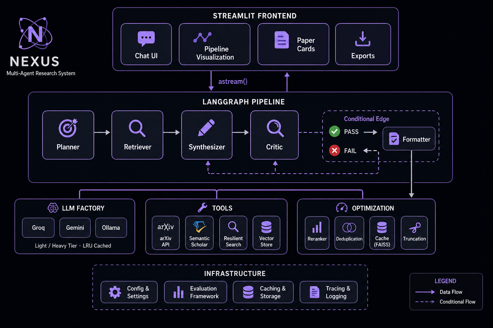

# Nexus Research Agent: High-Performance Multi-Agent System

An autonomous, enterprise-grade research pipeline designed to transform raw scientific queries into verified, high-quality research summaries. This system leverages **LangGraph** for stateful orchestration and **Groq/Gemini** for high-velocity inference.

---

## 📌 Project Overview
The **Nexus Research Agent** addresses the "hallucination" and "token-bloat" challenges in academic RAG. By implementing a **Parallelized 4-Agent Pipeline**, the system ensures findings are cross-referenced against authoritative sources like **arXiv** and **Semantic Scholar**. Recent optimizations have reduced retrieval latency from **~30s to ~5-10s**.

## 🛠 Tech Stack
* **Intelligence:** Groq (Llama 3.3/3.1), GPT-4o, Gemini Flash 2.5, and Ollama.
* **Orchestration:** LangGraph (Stateful cyclic/acyclic graphs).
* **Retrieval Engine:** Concurrent Python `ThreadPoolExecutor`.
* **Vector Store:** FAISS (Local caching).
* **Reranking:** `cross-encoder/ms-marco-MiniLM-L-6-v2`.
* **Observability:** LangSmith (V2 tracing).

---

## ⚡ The "10-Fix" Performance Architecture

### 1. High-Speed Orchestration
* **Parallel Retrieval:** Concurrent fetching from arXiv + Semantic Scholar reduces latency by ~70%.
* **LLM Instance Caching:** `@lru_cache` ensures agents reuse connection pools instead of reconstructing clients.
* **Abstract Truncation:** Snippets are capped at 200 chars, cutting input tokens by ~40%.

### 2. Model Tiering & Cost Management
| Tier | Task | Representative Model | Token Cap |
| :--- | :--- | :--- | :--- |
| **Light** | Planner | Llama-3.1-8b-instant | 200 |
| **Heavy** | Synthesizer | Llama-3.3-70b-versatile | 1500 |
| **Heavy** | Critic | Llama-3.3-70b-versatile | 500 |

### 3. Data Integrity & Relevance
* **Cross-Encoder Reranker:** Local reranking keeps only the Top 8 most relevant papers.
* **Paper Deduplication:** Automated title-based deduplication across sub-queries.
* **FAISS Cache:** Persistent local caching for accelerated analytical lookups.

---

## 🚀 Key Features
* **AI Agnostic Design:** Unified configuration for Groq, Gemini, and local providers.
* **Conditional Feedback Loops:** The Critic agent triggers re-runs for low-quality findings.
* **LangSmith Tracing:** Full per-node latency and token observability.
* **Startup .env Guard:** Proactive API key validation on application boot.

---
*Developed by [Chinmay Kulkarni](https://github.com/ckulkarni13)*
